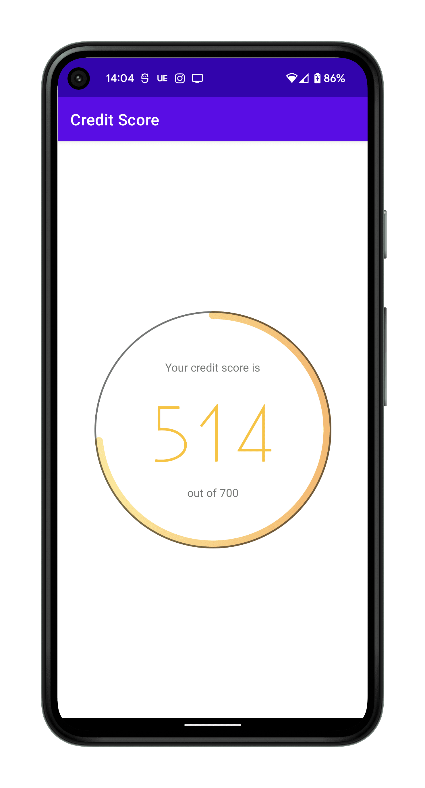
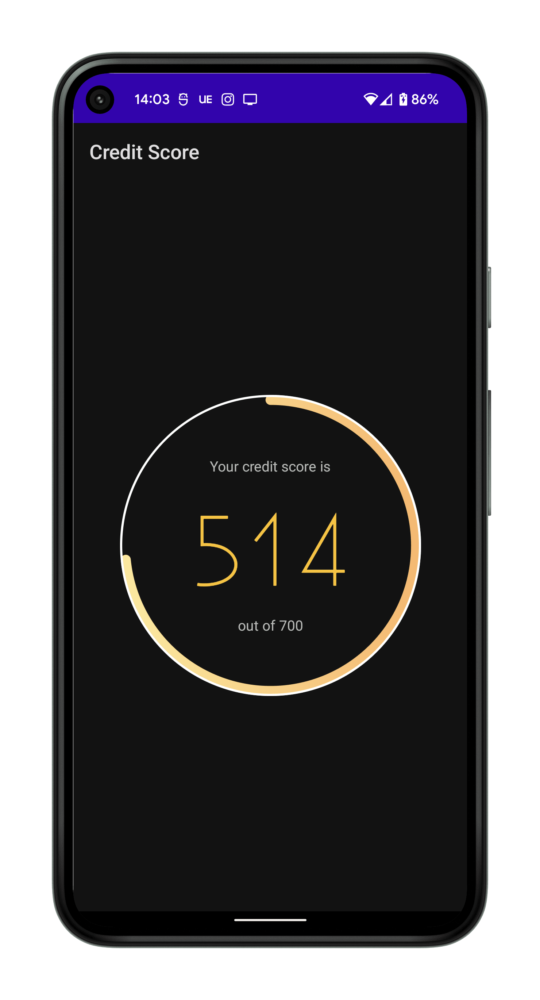

# Credit Score

### Overview

<hr>

Credit Score app solution.

Fetches credit score report & displays it to the user in the form of current score, maximum score,
and the score percentage as circular progress bar.

While retrieval is in progress, circular progress bar is spinning to inform the user, and the UI
indicates `?` as the pending credit score.

On failure (e.g. network error) a Toast is displayed, and the UI is updated with `!` as the score &
instructions advising the user of the steps to retry the loading.

<br>

### Screenshots

<hr>

<p float="left">
  
  
</p>

<br>

### Demo (opens on YouTube)

<hr>

[](https://www.youtube.com/watch?v=f7oraxDZjhY)

<br>

### Running Tests

<hr>

Simply use Android studio, or run the following.

Unit tests:

```bash
./gradlew test
```

Instrumentation tests:

```bash
./gradlew connectedAndroidTest
```

<br>

### Added Dependencies

#### Circular Progress Bar

[CircularProgressBar](https://github.com/lopspower/CircularProgressBar) was preferred over stock
Android constructs to utilise its color gradient support & avoid reinventing a custom solution.

Used for displaying credit score as a circular bar.

Also used to indicate progress while credit score is loading.

#### Jetpack Navigation Component

Used for navigating to fragment destinations, as a modern way to offload UI off `Activity` while
avoiding `FragmentManager` APIs.

#### Coroutines

Used for executing work asynchronously (e.g. web client requests).

#### Moshi

Used for deserialization of response bodies.

#### Retrofit

Used for networking stack (based on OkHttp client).

#### Koin

Used for Dependency Injection.

#### MockK

Used to mock dependencies & make testing easier.

<br>

### Imported resources

<hr>

#### Custom font - 'EXISTENCE LIGHT'
